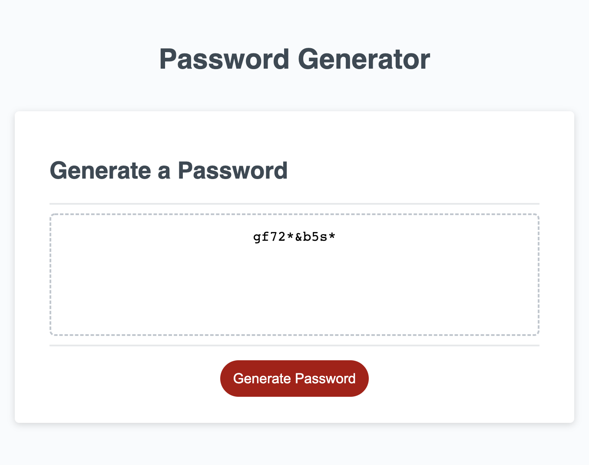

# Password Generator Starter Code

## Purpose

### Given User Story
AS AN employee with access to sensitive data
I WANT to randomly generate a password that meets certain criteria
SO THAT I can create a strong password that provides greater security

### This application has been developed to:
1. On click of the Generate Password button
2. Prompt the user through a series of password criteria 
    - Input password length of 8-128 characters
    - Yes/No to lowercase, uppercase, numeric, and special characters
3. Validate user input to confirm at least one criteria has been selected
4. Generate a password matching the selected criteria
5. Display the generated password in the box on the screen

## Application Details

This application is optimized for use on screen widths 690px & 500px.

Main application code runs through JavaScript.

### JavaScript Logic Summary
- When the user clicks the generate password button, call function writePassword.
- writePassword defines the display text (password) as the product(return) of the function generatePassword
- generatePassword collects user input (passwordLength & generateCriteria function) and validates them using if statements
- generatePassword then calls readPickedCriteria function, which looks for each criteria option inside the selected user input array (userPickedCriteria), and, if it finds it, adds an array of those values to passwordContent, which we then turn into a string
- Continuing in generatePassword, the passwordContent is turned back into an array (.split), & we randomly pick characters from that array (getRandom) and add them to our password (.push)
- Function ends with return passwordArray.join("") to display in the text box

### Main Files In Repository
- index.html
- style.css
- script.js

## Deployed Application

[(Link to deployed application)](LINK GOES HERE)

Screenshot of deployed application:
Criteria given for the screenshot: Password length = 10 / Characteristics selected = lowercase, numeric, special

